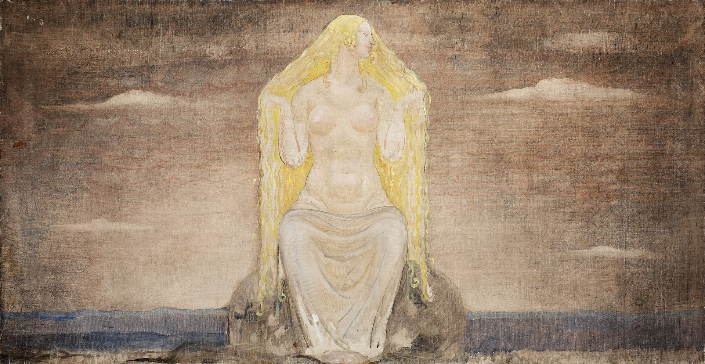

  
In the Poetic Edda, the Vanir as a group are specifically referenced in the poems Völuspá, Vafþrúðnismál, Skírnismál, Þrymskviða, Alvíssmál and Sigrdrífumál. In Völuspá, a stanza describes the events of the Æsir–Vanir War, when the Vanir broke the walls of the stronghold of the Æsir, and states that the Vanir were "indomitable, trampling the plain."[4]
  

  
In Vafþrúðnismál, Gagnráðr (the god Odin in disguise) engages in a game of wits with the jötunn Vafþrúðnir. Gagnráðr asks Vafþrúðnir where the Van god Njörðr came from, for though he rules over many hofs and hörgrs, Njörðr was not raised among the Æsir. Vafþrúðnir responds that Njörðr was created in Vanaheimr ("home of the Vanir") by "wise powers" and that during the Æsir–Vanir War Njörðr was exchanged as a hostage. When the world ends (Ragnarök), Njörðr "will return to the wise Vanir."[5]