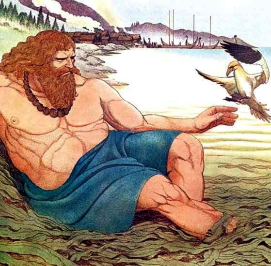

  
While there are quite a few Vanir deities, three principle figures emerge. First is Njord. Njord was generally associated with wealth, fertility, and seafaring. He had a short marriage to the giantess Skadi, which ended because he hated her home in the mountains and she couldn't stand his home on the beach.
  

  
Njord had two children named Freya and Freyr, and while we're not quite sure who their mother was, these two were also prominent Vanir deities. Freya was a fertility goddess, characterized by a love of beauty and material possessions. In many stories of the gods, she's the partier; the one who likes to let her hair down and have a good time. This doesn't mean, however, that she was weak. Freya taught the gods the magical art of controlling the fates of the cosmos and could basically bend anyone or anything to her will. Freyr, her brother, was another fertility god, associated with prosperity, benevolence, and well-being. So, it's really not surprising that Freyr was one of the most beloved gods, both in terms of mythology and actual daily Norse life. He brought peace, bountiful harvests, and health and travelled on a magical ship that could be folded up and carried in a bag. 
  
